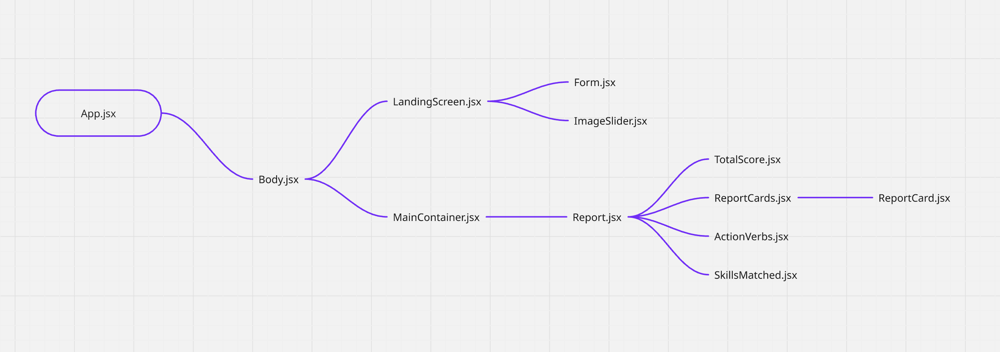
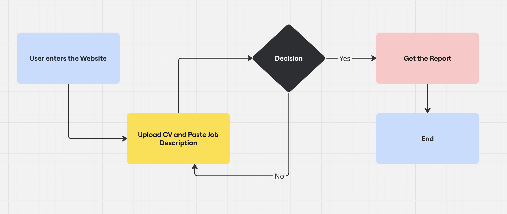
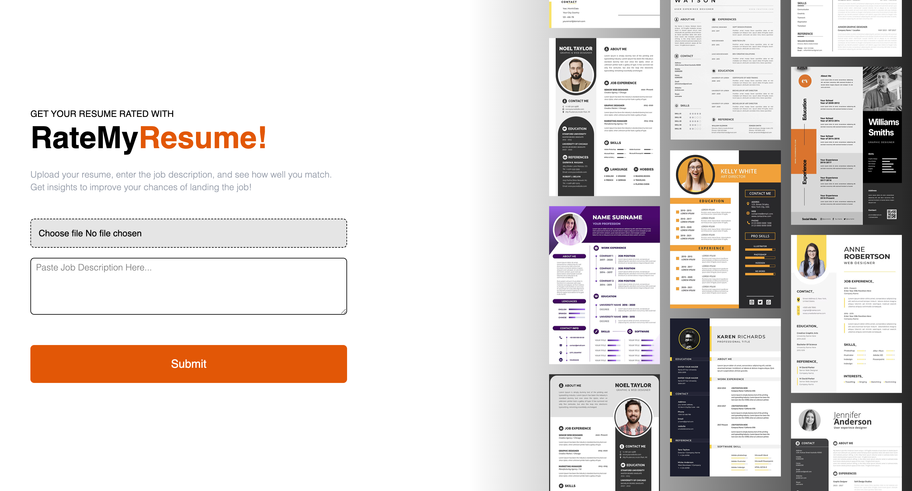
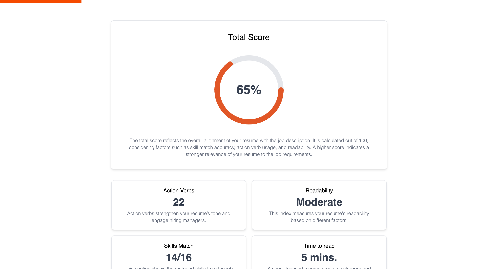

# 📄 RateMyResume

RateMyResume is a web application built with Vite, React, and Tailwind CSS that allows users to upload their resume and a job description. The app intelligently analyzes both to generate a detailed score and report based on several hiring factors.

## Features

- Resume & Job Description Analysis
- Skill Matching
- Action Verb Count
- Readability Score
- Detailed JSON Report
- Strict Scoring System

## Tech Stack

**📦 Data Management & State Handling :** React, Redux Toolkit

**🎨 UI & Animations :** Tailwind CSS, Framer Motion

**🛠 Bundler & Build Tools :** Vite

## Component Structure



## User Flow



## Example Usage

- Upload Resume (CV)
- Enter Job Description (JD)
- Click Analyze
- Receive a structured JSON Report including:
  - Readability Score
  - Skill Match
  - Number of Action Verbs
  - Total Score

## Screenshots





## JSON Report Format (Returned After Analysis)

```javascript
{
  "Time to read": "X mins.",
  "Number of action verbs used in the resume": X,
  "Skill match": "X/Y",
  "Readability": "[Easy / Moderate / Difficult]",
  "Skills matched": {
    "skill1": "X/Y",
    "skill2": "X/Y",
    "...": "X/Y"
  },
  "Action verbs used in CV": [
    "action verb 1",
    "action verb 2",
    "action verb 3"
  ],
  "Total score": "X"
}
```

## Required Variable

To run this project, you will need to add the following variables to your constants file

`GEMINI_API_KEY`

## Demo

Live Link : https://rate-my-resume.netlify.app/
