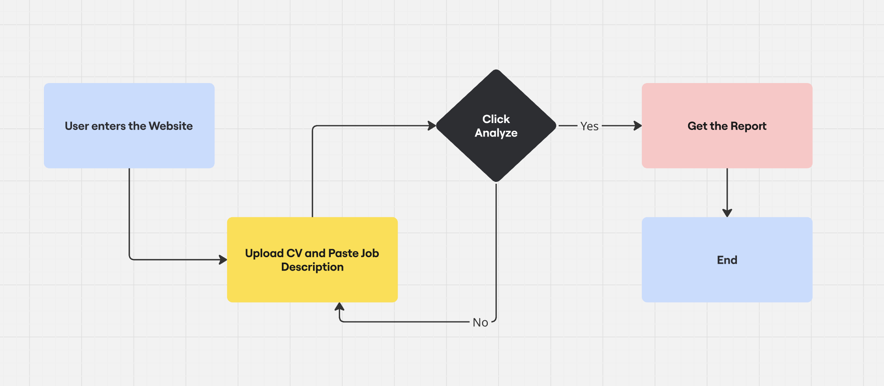
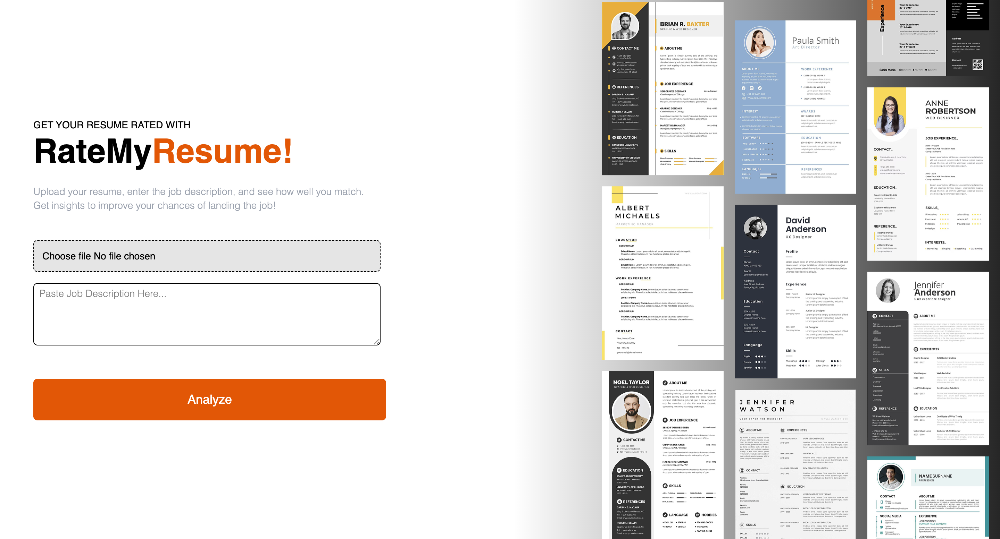

# 📄 RateMyResume

RateMyResume is a web application built with Vite, React, and Tailwind CSS that allows users to upload their resume and a job description. The app intelligently analyzes both to generate a detailed score and report based on several hiring factors.

## Problem Statement

Many job seekers struggle to match their resumes with specific job descriptions, which lowers their chances of getting noticed. Manually comparing skills, readability, and key action words can be tiring and confusing.
RateMyResume solves this by using the Gemini API to quickly analyze a resume and job description. It provides a detailed report showing skill match, action verbs used, readability, and a total score — helping users improve their resumes for better job opportunities.

## Features

- Resume & Job Description Analysis
- Skill Matching
- Action Verb Count
- Readability Score
- Detailed JSON Report
- Strict Scoring System

## Tech Stack

**📦 Data Management & State Handling :** React, Redux Toolkit

**🎨 UI & Animations :** Tailwind CSS, Framer Motion

**🛠 Bundler & Build Tools :** Vite

## Component Structure


## User Flow



## Example Usage

- Upload Resume (CV)
- Enter Job Description (JD)
- Click Analyze
- Receive a structured JSON Report including:
  - Readability Score
  - Skill Match
  - Number of Action Verbs
  - Total Score

## Screenshots




## JSON Report Format (Returned After Analysis)

```javascript
{
  "Time to read": "X mins.",
  "Number of action verbs used in the resume": X,
  "Skill match": "X/Y",
  "Readability": "[Easy / Moderate / Difficult]",
  "Skills matched": {
    "skill1": "X/Y",
    "skill2": "X/Y",
    "...": "X/Y"
  },
  "Action verbs used in CV": [
    "action verb 1",
    "action verb 2",
    "action verb 3"
  ],
  "Total score": "X"
}
```

## Required Variable

To run this project, you will need to add the following variables to your constants file

`GEMINI_API_KEY`

## Demo

Live Link : https://rate-my-resume.netlify.app/
